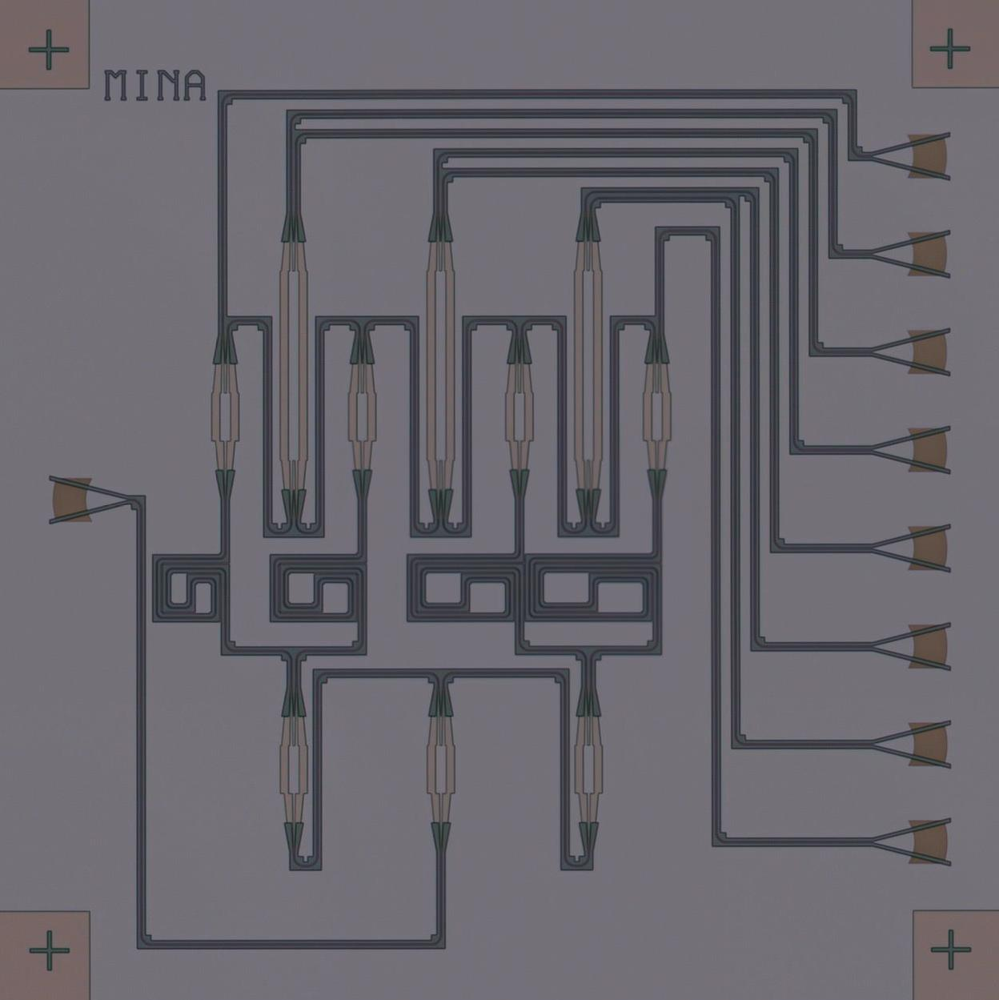

# Passive Photonic Phased Array Readme

Welcome to the Passive Phased Array project! This repository contains the design files and documentation for a Passive Photonic Phased Array implemented using silicon photonics platform. This README will guide you through the project and its components.

## Repository Structure
- **Python Notebook**: Contains the design, layout and simulation of the PIC.
## Characterization
**The Characterization data are currently being analyzed and will be added ASAP!!**

## Fabricated Chip Image

## Disclaimer
This project is done as a part of the coursework of photonic integrated circuits course taught at uGent by professor Wim Bogaerts.
The chip was fabricated using electron beam lithography technique using the facilities of uGent.
## References
The project is a recreation of a similar system to the one present in this article:
[https://www.nature.com/articles/s41598-022-23456-7]

Thank you for your interest in the Passive Photonic Phased Array project!
